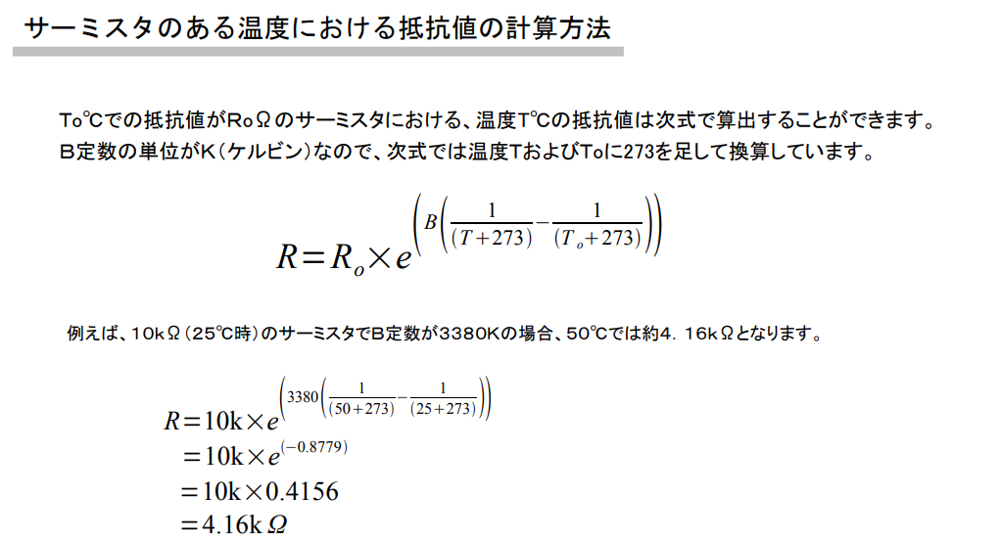

# soil-sensors

Soil sensors (EC/TDS, temperature, soil moisture) for Arduino UNO

## components

- https://akizukidenshi.com/catalog/g/g107257/
- https://akizukidenshi.com/catalog/g/g107047/
- https://amzn.asia/d/06FOONtP

## references

- https://araisun.com/Arduino-thermistor/
- https://energy-note.hatenablog.com/entry/2020/04/29/001912
- https://qiita.com/hamadaira0412/items/dfad0e8c9658a588c2dd
- https://hackaday.io/project/7008-hacking-the-way-to-growing-food/log/24646-three-dollar-ec-ppm-meter-arduino
- https://www.makers-academy.net/2021/09/16/arduino_ec/
  ...

## method

### templature

### tds/ec

測定方法は2個の電極を水溶液に浸け、測定した電気抵抗から算出します。  

また水溶液の電気の通しやすさは温度の影響も受けるため、正確な値を測定するためには温度による補正が必要です。  

電気伝導率の補正式  
κ25 ＝κｔ／［1 ＋α（ｔ－ 25）］  
κ25：25 ℃の電気伝導率  
κｔ：ｔ ℃の電気伝導率  
α：温度係数  

TDSとは、無機塩類、有機物、懸濁物質など、水中に溶解している固形物の総量を指し、電気伝導率（EC）とは、水中のイオンが電流を伝導する能力を指します。TDSとECには正の相関関係があります。  

TDS （ppm）＝K×EC （μS/cm）  
注：電気伝導率の用語および一部の導電率計では、EC（電気伝導率単位の略）とCF（導電率係数の略）が単位としてよく使用されます。1 EC = 0.1 CF = 1 μs/cm。  

電気伝導率の計算とセル定数（電極定数）  
電気伝導率κ（カッパ）は、2個の電極を電解質水溶液に浸した場合の電極間の電気抵抗の逆数で示され、以下の式で求めることができます。  
電気伝導率(κ)= 電圧(E)/電流(I)xセル定数（電極定数）(k)  
セル定数は電極面積、電極間の距離によって求めることができますが、作成した電極の面積や距離のばらつきが大きく計算が困難なため、電気伝導率の分かっている標準液（塩化カリウム溶液）の電気伝導率を測定することで決定します。  

温度補償  
水溶液の電気伝導率は温度により変化します。水耕栽培の環境において、液肥を常に一定の温度に保って計測することは現実的に困難ですので、あらかじめ定めた温度（通常25℃）における電気伝導率に換算します。以下の式で換算することができます。  
25℃の電気伝導率(κ25)=t℃の電気伝導率(κt)/(1+温度係数(α)(温度(t)-25))  
温度変化による電気伝導率の変化量は水溶液の種類（イオン成分や濃度の違い）により異なりますが、温度係数は一般的に塩化カリウム標準液の2%/℃が使用されます。  